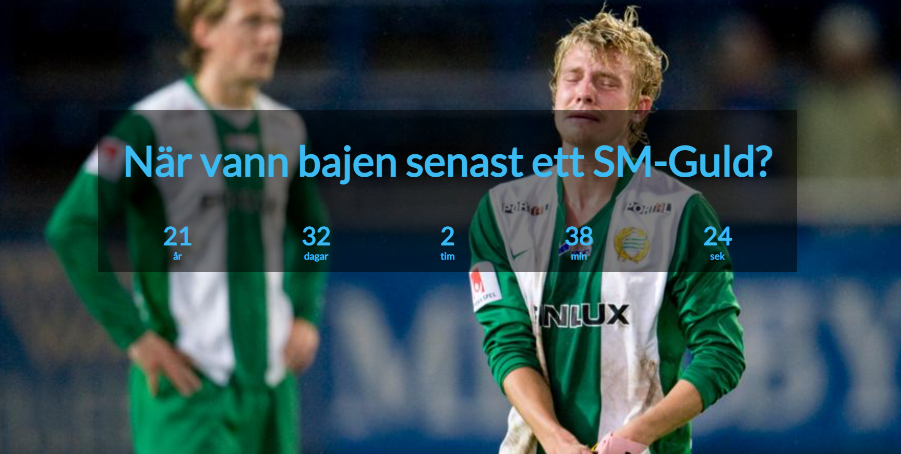

# :stopwatch: Count Up Timer (bajen-Edition)

> This is simply a private lab to try out the deployment of an website to a custom domain through GitHub Pages.

A simple website written in JavaScript, HTML & CSS that is counting up from the date that is specified in the code.

## :scroll: Introduction

The story behind the date specified in the code and the background picture on the website is the last time the Swedish football team Hammarby won the Swedish Football League (Allsvenskan). Long time ago in other words.....

## :gem: Website

